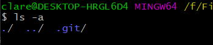
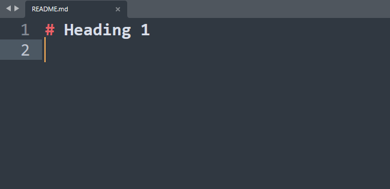
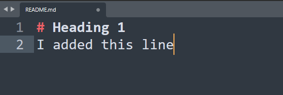

# Git Primer

For those of you who are new to Git, or version control systems in general, this repository contains a primer on how to use Git, the most popular version control system.

<br>
<br>

The steps shown in this primer are done through the command line/terminal. It assumes that you know how these commands work: `ls`, `cd`, `pwd`, `rm`, and `mkdir`. They are available on Linux, and MacOS.

> If you are not familiar with these commands, [read this first](./pre-requisites/basic-terminal-commands.md).

<br>
<br>

On Windows, you have similarly-named commands which, for the most part, are similar enough to those on Linux and MacOS systems. You can use them as long you don't pass them flags because they are different to those found on the other two systems:

> For example, to list all the files inside a directory, including hidden ones, you can run the following command on Linux and MacOS systems:
>
> > `ls -a`
>
> On Windows PowerShell, you would use:
>
> > `ls -Force`

However, if you want to use the Linux and MacOS version of those commands on Windows, you can use `Git Bash` which is included if you install the [official Windows installer of Git](#windows).


It also helps to know how to use `glob patterns`.

<br>
<br>

## Installation

### Linux

- Debian-based systems (Ubutu, Pop OS, Linux Mint, etc):
  ```
  sudo apt install git
  ```
- Red Hat-based systems (CentOS, Fedora, etc):
  ```
  sudo yum install git
  ```
- Arch-based systems (Manjaro, etc):
  ```
  sudo pacman -S git
  ```

### Windows

- Download the official [Git for Windows](https://git-scm.com/download/win) installer.
- Or via Chocolatey:
  ```
  choco install git
  ```

### MacOS

- Apple ships a binary package of Git with [Xcode](https://apps.apple.com/us/app/xcode/id497799835?mt=12).
- Or via Homebrew:
  ```
  brew install git
  ```

To verify that you have Git installed successfully, you can run the following command:

```
git --version
```

Which should return something like:

```
git version 2.35.1.windows.2
```

<br>
<br>

## Git Repositories

Basically, a Git repository is a directory where it's contents are tracked. Git tracks the contents of a repository by keeping a record of all their changes.

There's **two types** of repositories: **local** and **remote**:

- **Local repositories** are stored on your computer, and are the most common type of repository.
- **Remote repositories** are stored on a server somewhere, and are used to store code that you want to share with others.

[**Github**](https://github.com/) is platform that can be used to host remote repositories, and it is the most popular one at that.

<br>
<br>

## Creating a local repository

> _Before we create a repository, it is helpful to create a dedicated central directory where all repositories will be stored. In my case, I created a directory called `repos` inside my user home folder using the command:_
>
> > `mkdir ~/repos`.
>
> _I then go inside that folder using:_
>
> > `cd ~/repos`.

1. You can create a new directory:

```
mkdir my-repo
```

> ...or use an existing one to turn into a repository.

1. Enter the directory:

```
cd my-repo
```

3. Then initialize the repository:

```
git init
```

The directory is now a Git repository that can be tracked for changes.

We can tell that the directory is a repository by inspecting its contents:

```
ls -a
```

> We need the `-a` flag to see hidden files.



As you can see, there is a hidden `.git` folder inside. This is where Git keeps the information it needs like configurations, branches, commits, staged files, etc.

<br>
<br>

## Configuring A Local Repository

Before we continue any further, we should configure our repository first. Git requires that we configure our repository before we can `commit` to it.

Run both of this commands in the same directory:

```
git config --local user.name "Your Name"
```

```
git config --local user.email "Your Email"
```

We could add more configs here, but git only requires the `user.name` and `user.email` configs, it's enough for now. The command `git config --local` will store the configs in the current repository it is called in.

Storing the config in the current repository means that you need to also configure every other repositories you create.

If you want to have a config for the current operating system user, you can use `git config --global` instead.
This will store the configs in your user home directory so you don't have to run config commands every time you create a repository.

<br>
<br>

## Staging Files

After you initialize a repository, all its contents are "unstaged" by default. Files added after initializing the repositories will also be unstaged. For git to be able to track a file for changes, we need to stage it first.

To put this to test, run this command first:

```
git status
```

> `git status` will show you details about the state of the repository.

If the directory is empty, it should return something like this:

```
On branch master

No commits yet

nothing to commit (create/copy files and use "git add" to track)
```

> If you turned an existing non-empty folder into a repository, it will list all the files in the repository as `untracked`.

Try to create a file in repository, in my case, I created a file `README.md` that contains a single line of text:


Then ran `git status` again. This is what it returned:

```
On branch master

No commits yet

Untracked files: <============
  (use "git add <file>..." to include in what will be committed)
        README.md <============
```

As you can see, every file (we just have one here) in the repository is listed as untracked.

We need to stage this file first. This is done using the command:

```
git add [file/directory]
```

Since our repository is small, we can just name the file that we want to stage.

```
git add README.md
```

But if we had a bigger repository, we can't just manually add the files one by one. That would be tedious. Instead we can use a `glob pattern` in place of the file name:

```
git add *
```

> The `*` glob pattern is called a wildcard, and it will match all the files in the current directory so we don't have to add them manually one by one.

> We call also use `git add .` or `git add -A` which does the same thing as the `git add *` command.

After adding the file, we can check the status again using `git status`, this is the output:

```
On branch master

No commits yet

Changes to be committed:
  (use "git rm --cached <file>..." to unstage)
        new file:   README.md <============
```

README.md is now staged. In this instance, we actually have a two "copies" of the file. The first copy is the one that we have in the current working directory.

> In git, we refer to the current working directory as the "working tree". From now on, I'll use the term "working tree" to refer to it.

After we staged the file using `git add`, Git created the second copy of the file and store it a location called the "staging area".

> Staging area has other names like "index", "index tree", "staging index", or "cache". I prefer to use the "index tree" to keep it consistent with the "working tree".

Git will be able to tell if we modify the file in the working tree by comparing it to the file in the index tree.

To test this, I will now add another line to the copy in the working tree:



Then ran `git status` again. This is the output:

```
On branch master

No commits yet

Changes to be committed:
  (use "git rm --cached <file>..." to unstage)
        new file:   README.md  <= The copy in the index tree

Changes not staged for commit:
  (use "git add <file>..." to update what will be committed)
  (use "git restore <file>..." to discard changes in working directory)
        modified:   README.md  <= The copy in the working tree
```

If we `git add` to file again, it will stage the changes, which means it will apply the changes in copy of the working tree to the one in the index tree. If we run `git status` again, we will see:

```
On branch master

No commits yet

Changes to be committed:
  (use "git rm --cached <file>..." to unstage)
        new file:   README.md
  // there's no unstaged changes anymore
```

> The working tree and the index tree are now in sync.

<br>
<br>

## Committing Changes

If you ever played a game before, like an RPG game or any games that uses saves or checkpoints, you more or less know what a commit is. A commit is basically a saved state for a repository.

Just like how we can create multiple save files as we progress in a game, we can also create multiple commits as we progress in a repository.

A newly initialized repository has no commits by default. That's why you see the message "No commits yet" after running `git status`.

```
On branch master

No commits yet <===============

Changes to be committed:
  (use "git rm --cached <file>..." to unstage)
        new file:   README.md

Changes not staged for commit:
  (use "git add <file>..." to update what will be committed)
  (use "git restore <file>..." to discard changes in working directory)
        modified:   README.md
```

Commits are used to make git "remember" a version of the contents in the repository at a certain point in time. Specifically, git remembers the version of files that are staged. That's why we stage the files/changes to a file first before we can commit anything.

> Think of the index tree/staging as an area where we prepare files/changes that we want to commit.

Since we already staged the file, we can now commit the changes. To do this, we use the command:

```
git commit -m "commit message"
```

> Make the commit message concise but descriptive about the changes. It will help you to understand what the commit is for.

It should return something like this:

```
[master (root-commit) 43e73ad] commit message
 1 file changed, 2 insertions(+)
 create mode 100644 README.md
```

Run `git status` again and we should see:

```
On branch master
nothing to commit, working tree clean
```

Remember that when we stage a file, git creates a copy of the file in the index tree.

Committing will also create a new copy of the file but it will be stored in the `HEAD`/`HEAD tree`.

In this instances, we now have 3 copies of the `README.md` file.
