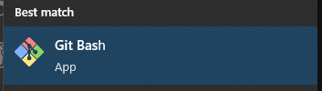

# Git Primer

For those of you who are new to Git, or version control systems in general, this repository contains a primer on how to use Git, the most popular version control system.

The steps shown in this primer are done through the command line/terminal. It assumes that you know how these commands work: `ls`, `cd`, `pwd`, `rm`, and `mkdir`. They are available on Linux, and MacOS.

> If you you are not familiar with these commands, [read this](./pre-requisites/basic-terminal-commands.md) first.

On Windows, you have similarly-named commands which, for the most part, is similar enough to those on Linux and MacOS systems. You can use them as long you don't pass them flags because they are different to those found on the other two systems:

> For example, to list all the files inside a directory, including hidden ones, you can run the following command on Linux and MacOS systems:
>
> > `ls -a`
>
> On Windows PowerShell, you would use:
>
> > `ls -Force`

However, if you want to use the Linux and MacOS version of those commands on Windows, you can use `Git Bash` which is included if you install the official Windows installer of Git.



It also helps to know how to use `glob patterns`.

## Installation

### Linux

- Debian-based systems (Ubutu, Pop OS, Linux Mint, etc):
  ```
  sudo apt install git
  ```
- Red Hat-based systems (CentOS, Fedora, etc):
  ```
  sudo yum install git
  ```
- Arch-based systems (Manjaro, etc):
  ```
  sudo pacman -S git
  ```

### Windows

- Download the official [Git for Windows](https://git-scm.com/download/win) installer.
- Or via Chocolatey:
  ```
  choco install git
  ```

### MacOS

- Apple ships a binary package of Git with [Xcode](https://apps.apple.com/us/app/xcode/id497799835?mt=12).
- Or via Homebrew:
  ```
  brew install git
  ```

To verify that you have Git installed successfully, you can run the following command:

```
git --version
```

Which should return something like:

```
git version 2.35.1.windows.2
```

## Git Repositories

Basically, a Git repository is a directory where it's contents are tracked. Git tracks the contents of a repository by keeping a record of all their changes.

There's **two types** of repositories: **local** and **remote**:

- **Local repositories** are stored on your computer, and are the most common type of repository.
- **Remote repositories** are stored on a server somewhere, and are used to store code that you want to share with others.

[**Github**](https://github.com/) is platform that can be used to host remote repositories, and it is the most popular one at that.

## Creating a local repository

> _Before we create a repository, it is helpful to create a dedicated central directory where all repositories will be stored. In my case, I created a directory called `repos` inside my user home folder using the command:_
>
> > `mkdir ~/repos`.
>
> _I then go inside that folder using:_
>
> > `cd ~/repos`.

1. You can create a new directory:

```
mkdir my-repo
```

> ...or use an existing one to turn into a repository.

1. Enter the directory:

```
cd my-repo
```

3. Then initialize the repository:

```
git init
```

The directory is now a Git repository that can be tracked for changes.

## Configuring A Local Repository

Before we continue any further, we should configure our repository first. Git requires that we configure our repository before we can `commit` to it.

Run both of this commands in the same directory:

```
git config --local user.name "Your Name"
```

```
git config --local user.email "Your Email"
```

We could add more configs here, but git only requires the `user.name` and `user.email` configs, it's enough for now. The command `git config --local` will store the configs in the current repository in is called in.

Storing the config in the current repository means that you need to also configure every other repositories you create.

If you want to have a config for the current operating system user, you can use `git config --global` instead.
This will store the configs in your user home directory so you don't have to run config commands every time you create a repository.

## Adding Files To A Repository

After you initialize a repository, all its files can be tracked Git. And once tracked, all changes to the content of the tracked files will be reported.

To put this to test, run this command first:

```
git status
```

If the directory is empty, it should return something like this:

```
On branch master

No commits yet

nothing to commit (create/copy files and use "git add" to track)
```

Try to add a file, in my case, I added a file called `README.md` to the repository.

Then ran `git status` again. This is what it returned:

```
On branch master

No commits yet

Untracked files:
  (use "git add <file>..." to include in what will be committed)
        README.md
```

> If you turned an existing non-empty folder into a repository, it will list all the files in the folder.

The output revealed two concepts that are important to Git, **branches** and **commits**. But before we tackle these concepts, let's talk about how tracking works in git first.

In our newly created repository, all our files are untracked by default. We need to tell git that we want to track them.

This is done using the command:

```
git add [file/directory]
```

Since our repository is small, we can just name the file that we want to track.

```
git add README.md
```

But if we had a bigger repository, we can't just manually add the files one by one. That would be tedious.

Instead we can use a `glob pattern` in place of the file name.

```
git add *
```

> We call also use `git add .` or `git add -A` which does the same thing as the `git add *` command.

The `*` glob pattern is called a wildcard, and it will match all the files in the current directory so we don't have to list all the files manually.

TODO: Continue this shit

If you ever played a game before, like an RPG game or any games that uses saves or checkpoints, you more or less know what a commit is. A commit is basically a save state for the repository.

A newly initialized repository has no commits by default. That's why you see the message "No commits yet", and that's also why all the files inside the folder are listed as untracked.
