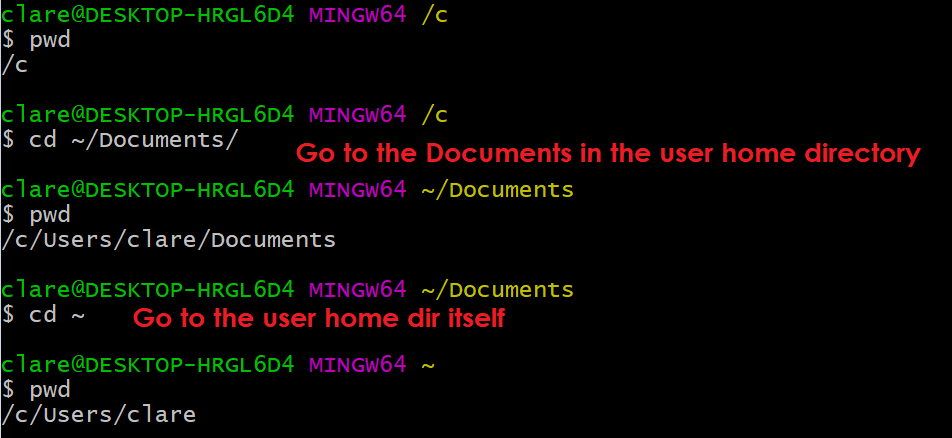

# Basic Terminal Commands

These are terminal commands that are used throughout this primer. These commands are available on Linux, and MacOS terminals.

Windows have similarly-named commands with similar functionality in PowerShell but they have use flags that are different from their Linux and MacOS counterpart. You can use `Git Bash` on Windows to use the actual same commands found on Linux and MacOS.

`Git Bash` is included if you install the [official Windows installer of Git](../README.md#windows).

The advantage of using `Git Bash` is that if you ever try to switch to a Linux or MacOS system, you have the same commands available so you don't have to relearn them.
<br>
<br>
<br>

## pwd

Basic Usage:

```
pwd
```

- Short for "print (current) working directory".
- The **current working directory** is the directory where the terminal is currently running in.
- The current working directory influences how files and directories are referenced through relative paths.


- Most of the time, `pwd` is not needed because most terminals already show it in their prompts.
  
  <br>
  <br>
  <br>

## cd

Basic Usage:

```
cd [directory]

// example:
cd C:/
```

- Short for "change directory" or "change directory to".
- This command changes the current working directory to the given path.


<br>
<br>
<br>

## ls

Basic Usage:

```
ls
```

- Short for "list".
- Running this command will list all the files and directories in the current working directory.


- Running this command with the `-a` flag will list all all files and directories, including hidden ones.

```
ls -a
```


> In Linux, and MacOS systems, files and folders that start with a `.` are considered hidden. That's why, in the above examples, `ls` didn't show `.hidden-file.txt` until we rerun the command with the `-a` flag.

<br>
<br>
<br>

## mkdir

```
mkdir [directory-name]

// example:
mkdir new-directory
```

- Short for "make directory".
- As the name suggests, this command creates a new directory in the current working directory.


<br>
<br>
<br>

## rm

```
rm [file/folder]

// example:
rm file1.txt
```

- Short for "remove".
- Deletes the file or folder specified.


- If you try to delete a folder using `rm`, it will show an error message.


- This is because a directory might have files inside it will also be deleted along the directory. You need to pass a flag `-rf` to to tell `rm` to recursively force delete the folder and all of its contents.

```
rm -rf [directory]
```


<br>
<br>
<br>

## clear

```
clear
```

- Clears the terminal screen.
- This is useful for clearing the terminal screen if it's getting too cluttered with text.

<br>
<br>
<br>
If you know how relative and absolute paths work, you can skip the next section.

## More On Paths

Paths describe the location of a file or directory in the file system.

### Absolute Paths

- Absolute paths describe how to get to a file or directory starting from a root directory.
- The most common root directory is the root of the file system.

  - Examples are:

    - For Windows:
      ```
      C:\Users\John\Documents\GitHub\git-primer\README.md
      ```
    - For Linux and MacOS:

      ```
      /Users/John/Documents/GitHub/git-primer/README.md
      ```

    - In the Windows case, the root of the file system prefixed with a drive letter like `C:\`
      
    - In the Linux and MacOS case, the root is simply `/`.

- Another type of root is the user's home directory. `~` is a shortcut for the user's home directory.

  > On Windows, the user home directory is usually located at `C:\Users\[Your Username]`. On Linux and MacOS, it's usually located at `/home/[Your Username]`.

  - Examples:

    - For Windows:

    ```
    ~\Documents\GitHub\git-primer\README.md
    ```

    - For Linux and MacOS:

    ```
    ~/Documents/GitHub/git-primer/README.md
    ```

  

- Because absolute paths are always relative to a root path, no matter where the current working directory is, the path `C:\File\File.txt` will refer to the same file.
  Unlike a relative path, like `./File.txt`, which could be a different file depending on the current working directory.

### Relative Paths

- Relatives paths describe how to get to a file or directory from the current working directory.
- Examples are:

  - For Windows:

    ```
    .
    .\
    .\README.md
    README.md
    ..
    ..\
    ..\README.md
    ```

  - For Linux and MacOS:

    ```
    .
    ./
    ./README.md
    README.md
    ..
    ../
    ../README.md
    ```

* The paths `.`, `.\` (Windows), `./` (Linux and MacOS) are equivalent, they all refer to the current working directory.


- Paths without a prefix like `README.md` and those that are prefixed with a `./` or `.\` (Windows) like `./README.md` or `.\README.md` (Windows) are all relative to the current working directory.

  - For example, given the file `README.md`, if you're current working directory is`F:\Files\MD\`, then `.\README.md` or `README.md` is a file relative to the `MD` directory, that is: it is stored inside the `MD` directory.
    
  - If we would reference `README.md` using an absolute path, it would be `F:\Files\MD\README.md`.

* The paths `..`, `..\` (Windows), `../` (Linux and MacOS) are also equivalent, they all refer to the `parent directory`. The parent directory is the directory that contains current working directory.
  - If the current working directory is `F:\Files\MD\`, then it's parent directory is `F:\Files\`
  - When used with `cd`, it effectively moves up one directory. You can even chain them, if you run `cd ../../` it will move two directories up.
    

- Paths that are prefixed with a `../` or `..\` are relative to the parent directory.
  - For example, given the directory `MD2`, if you're current working directory is`F:\Files\MD\`, then `..\MD2` is a directory relative to the `Files` directory (which is `MD`'s parent directory), that is: it is stored inside the `Files` directory. In other words, `..\README.md` refers to the file which is stored in the same folder as the current working directory `MD`.
    
  - If we would reference `README.md` using an absolute path, it would be `F:\Files\README.md`.
