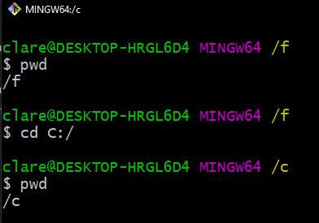

# Basic Terminal Commands

These are terminal commands that are used throughout this primer. These commands are available on Linux, and MacOS terminals.

Windows have similarly-named commands with similar functionality in PowerShell but they have use flags that are different from their Linux and MacOS counterpart. You can use `Git Bash` on Windows to use the actual same commands found on Linux and MacOS.

The advantage of using `Git Bash` is that if you ever try to switch to a Linux or MacOS system, you have the same commands available so you don't have to relearn them.

This tutorial in done on Windows, so you will see Windows paths.

## pwd

Basic Usage:

```
pwd
```

- Short for "print (current) working directory".
- The **current working directory** is the directory that the terminal is currently running in.
- The current working directory influences how files and directories are referenced and shown in the terminal.


### cd

Basic Usage:

```
cd [directory]

// example:
cd C:/
```

- Short for "change directory" or "change directory to".
- As the name implies, this command changes the current working directory.



TODO: Add more information about the `cd` command.

### ls

Basic Usage:

```
ls
```

- Short for "list".
- Running this command will list all the files and directories in the current working directory.


- Running this command with the `-a` flag will list all all files and directories, including hidden ones.

```
ls -a
```


> In Linux, and MacOS systems, files and folders that start with a `.` are considered hidden. That's why, in the above examples, `ls` didn't show `.hidden-file.txt` until we rerun the command with the `-a` flag.

### mkdir

```
mkdir [directory]

// example:
mkdir new-directory
```

- Short for "make directory".
- As the name suggests, this command creates a new directory in the current working directory.


### rm

```
rm [file/folder]

// example:
rm file1.txt
```

- Short for "remove".
- Deletes the file or folder specified.


- If you try to delete a folder using `rm`, it will show an error message.


- This is because a directory might have files inside it. You need to pass a flag `-r` to to tell `rm` to recursively delete the folder and all of its contents.

```
rm -r [directory]
```


### clear

```
clear
```

- Clears the terminal screen.
- This is useful for clearing the terminal screen if it's getting too cluttered with text.
